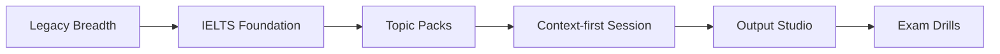

# VocabMan

<p align="center">
  
</p>

<p align="center"><strong>Context-first vocabulary learning for IELTS-focused learners.</strong></p>
<p align="center"><strong>面向雅思学习者的语境优先词汇学习应用。</strong></p>

<p align="center">
  <a href="https://github.com/ZJUZhiyuCai/Vocab"></a>
  <a href="https://vocabman.netlify.app"></a>
  
  
  
</p>

## Language

- [English](./README.en.md)
- [简体中文](./README.zh-CN.md)

## Snapshot

- Live site: [https://vocabman.netlify.app](https://vocabman.netlify.app)
- IELTS Foundation: `541` curated context bundles
- Official Topic Packs: `8`
- Main paths: `Today`, `Context-first Session`, `Output Studio`, `Exam Drills`
- AI runtime: `SiliconFlow` + `Qwen/Qwen2.5-72B-Instruct`
- Deployment-safe AI path: browser route + Netlify/server proxy fallback

## Why This Repo Matters

VocabMan is no longer just a flashcard app. The repository now contains a more structured IELTS vocabulary system:

- A curated `Foundation` layer for high-transfer vocabulary
- `Topic Packs` organized around common IELTS themes
- Context-based practice before output-heavy study
- Short-form production drills before full writing and speaking pressure
- A safer AI integration path that keeps secrets out of the public bundle

## Learning Architecture



## Quick Start

```bash
npm install
npm run dev
```

```bash
npm run build
npm run audit:real
node scripts/qa-validate-bundles.js public/data/ielts-foundation.json
```

## Environment

Use local-only secrets in `.env.local` and server-side secrets in Netlify or your hosting platform.

```bash
VITE_SUPABASE_URL=your-supabase-project-url
VITE_SUPABASE_ANON_KEY=your-supabase-anon-key
VITE_REDIRECT_URL=http://localhost:5173
SILICONFLOW_API_KEY=your-local-siliconflow-api-key
SILICONFLOW_MODEL=Qwen/Qwen2.5-72B-Instruct
SILICONFLOW_API_BASE_URL=https://api.siliconflow.cn/v1
```

## Project Docs

- [English README](./README.en.md)
- [中文 README](./README.zh-CN.md)
- [Contributing Guide](./CONTRIBUTING.md)
- [Changelog](./CHANGELOG.md)
- [IELTS Track Overview](./docs/23-IELTS-Learning-Track-Overview.md)
- [Release Notes](./docs/25-IELTS-Release-Notes.md)
- [Week 1 Learning Quality Plan](./docs/30-IELTS-Week-1-Learning-Quality-Plan.md)
- [Development Progress Map](./docs/31-IELTS-Development-Progress-Map.md)
- [Tomorrow Development Handoff](./docs/32-Tomorrow-Development-Handoff.md)

## Contributors

- `ZJUZhiyuCai` — product direction, repository ownership, IELTS rebuild
- `Codex` — release hardening, AI migration, documentation, launch support

## Code Architecture

The codebase follows Vue 3 Composition API best practices with extracted composables:

- `useAppState.js` — Central state management (words, progress, settings)
- `useWordOperations.js` — Word actions (audio, wordbook, AI generation)
- `useReviewSystem.js` — Spaced repetition and review queue logic
- `sanitize.js` — XSS-safe HTML rendering with DOMPurify

### Quality Metrics

- **Tests:** 50 unit tests with Vitest
- **Lint:** 0 errors (ESLint flat config)
- **Security:** DOMPurify for v-html sanitization

## License

MIT
