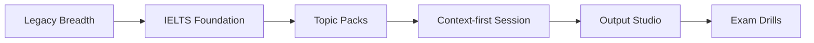

# VocabMan

<p align="center">
  
</p>

<p align="center"><strong>面向雅思学习者的语境优先词汇学习应用。</strong></p>

## 项目概览

VocabMan 是一个面向中文学习者的词汇学习应用，目标不是只让用户背更多单词，而是帮助用户逐步获得可迁移、可输出、可用于雅思场景的真实词汇能力。

当前仓库已经不只是“词表 + 卡片”，而是包含了一套重构后的 IELTS 学习系统、语境化 bundle 数据、产出导向练习路径，以及更安全的 AI 部署方案。

## 当前状态

- 在线地址：[https://vocabman.netlify.app](https://vocabman.netlify.app)
- 前端：`Vue 3` + `Vite` + `Tailwind CSS`
- 同步与登录：`Supabase`
- AI：`硅基流动` + `Qwen/Qwen2.5-72B-Instruct`
- License：`MIT`

## 产品方向

VocabMan 当前围绕以下原则演进：

1. 广度学习保留，但语境应逐步成为主要学习表面。
2. 雅思词汇应被组织成“可用的词汇系统”，而不是单纯按难度堆词。
3. 在高压输出前，先建立 paraphrase 和 collocation 的敏感度。
4. 输出训练应循序渐进，从短句、短回答开始。
5. AI 只做增强，不应该成为安全和部署风险。

## 当前 IELTS 学习系统

### Foundation

- 规范文件：`public/data/ielts-foundation.json`
- 兼容镜像：`public/data/ielts-core-500.json`
- Bundle 数量：`541`
- 词库 ID：`ielts-foundation`
- 作用：高迁移价值 IELTS 核心词汇语境包

### Topic Packs

| Topic | 数量 |
| --- | ---: |
| Education | 124 |
| Government | 108 |
| Environment | 71 |
| Technology | 52 |
| Health | 53 |
| Work | 32 |
| Media | 32 |
| Crime | 26 |

### 练习路径

- `Today`
  - 日常卡片学习与复习
- `Quiz`
  - 广度识别与测验
- `Context-first Session`
  - 语境预览、释义选择、改写匹配、微输出
- `Output Studio`
  - 句级可控输出练习
- `Exam Drills`
  - 面向阅读、听力、写作、口语表面的 IELTS 风格混合训练

## 学习路径图



## AI 运行方式

当前 AI 配置：

- 服务商：`硅基流动`
- 模型：`Qwen/Qwen2.5-72B-Instruct`
- 浏览器调用入口：`/api/ai/chat`
- Netlify 回退入口：`/.netlify/functions/ai-chat`
- 上游基址：`https://api.siliconflow.cn/v1`

这样设计的意义：

- 不需要把密钥打进前端 bundle
- 本地开发可直接使用 `.env.local`
- 部署环境可用服务端环境变量
- 某一路由失效时，客户端仍有兜底路径

## 本地开发

安装并启动：

```bash
npm install
npm run dev
```

构建：

```bash
npm run build
```

发布前检查：

```bash
npm run audit:real
node scripts/qa-validate-bundles.js public/data/ielts-foundation.json
node scripts/qa-validate-bundles.js public/data/ielts-core-500.json
```

## 环境变量

建议本地使用：

```bash
VITE_SUPABASE_URL=your-supabase-project-url
VITE_SUPABASE_ANON_KEY=your-supabase-anon-key
VITE_REDIRECT_URL=http://localhost:5173
SILICONFLOW_API_KEY=your-local-siliconflow-api-key
SILICONFLOW_MODEL=Qwen/Qwen2.5-72B-Instruct
SILICONFLOW_API_BASE_URL=https://api.siliconflow.cn/v1
```

说明：

- `.env.local` 仅用于本地，不应提交到 Git
- 生产环境密钥应配置在 Netlify 或你的部署平台
- API Key 不会同步到 Supabase

## 仓库结构

```text
src/
  components/
  layouts/
  utils/
public/
  data/
docs/
scripts/
netlify/
server/
```

重点目录：

- `src/components/context/`
  - IELTS 学习路径相关 UI
- `src/utils/`
  - 词库加载、SRS、AI、Auth、Storage
- `public/data/`
  - 正式 Foundation 与 Topic Packs 数据
- `scripts/`
  - 审计、QA、重建、维护脚本

## 路线图

- [x] 完成 IELTS Foundation 重构
- [x] 发布官方 Topic Packs
- [x] 上线 Context-first Session
- [x] 上线 Output Studio
- [x] 上线 Exam Drills
- [x] 将 AI 运行时迁移出旧的 OpenRouter/StepFun 路径
- [ ] 继续补强弱势 Topic 的高质量来源
- [ ] 增强部署与产品层面的可观测性

## Contributors

- `ZJUZhiyuCai`
  - 产品方向、仓库维护、IELTS 系统重构
- `Codex`
  - 发布收口、AI 迁移、文档整理、上线支持

## License

MIT
